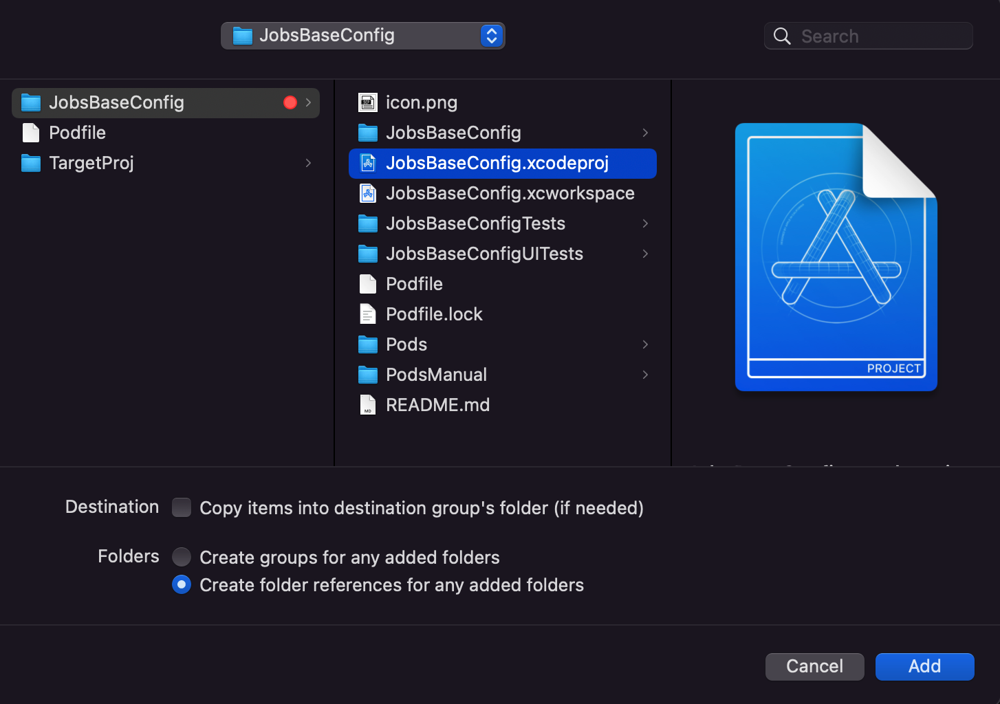
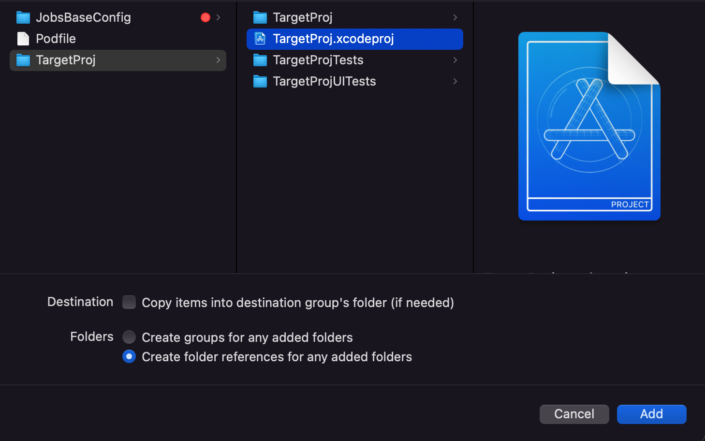
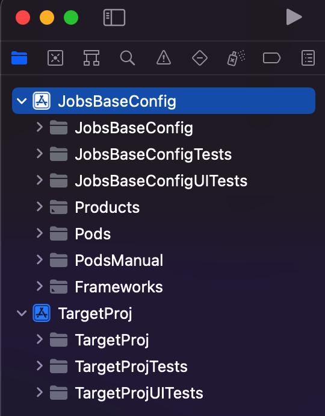
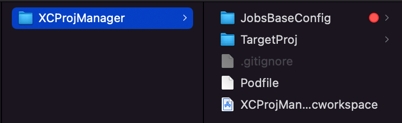

# 业务代码和第三方进行剥离
## 参考文献：https://www.jianshu.com/p/9eaebf93466f
## 目的：
    1、TargetProj 和 JobsBaseConfig 共用一个Pods;
    2、TargetProj 要能够访问 JobsBaseConfig 里面的文件;
    3、TargetProj 和 JobsBaseConfig 可以做为单独的项目进行编译（组件化开发）;
## 操作步骤：
    1、新建一个xcworkspace容器（以下称之为容器A）作为最外层统一管理各自的Project;
    2、在xcworkspace空白处右键出菜单，选择"Add Files to ...";
    3、引入后缀名为xcodeproj的Xcode目录索引文件;
        3.1、注意，不能引入pod install生成的xcworkspace;
        3.2、pod install生成的xcworkspace只对该文件目录下的xcodeproj有效;
    4、对容器A目录下的Podfile进行特殊的编写（参见:https://www.jianshu.com/p/9eaebf93466f）
        4.1、因为容器A下的每个工程文件都单独的享有一个文件夹，那么容器A旗下并不存在xcodeproj文件,而pod init是通过检索xcodeproj文件进行铆定挂载的，所以此时pod init会执行失败,需要手动建立Podfile文件(新建文本文件并去掉后缀名);🚀🚀🚀🚀🚀🚀🚀🚀🚀
    5、定位于容器A目录下并pod install;
    6、TargetProj 要访问共用的Pods需要对相关Pod在具体的Project进行单独的引用，否则编译会失败;🚀🚀🚀🚀🚀🚀🚀🚀🚀
    7、如果要使得TargetProj能够访问JobsBaseConfig的内容，需要定位于TargetProj的Target，在Build Settings下搜索Header Search Paths，加入"$(SRCROOT)/../JobsBaseConfig"，且属性改为recursive（递归检索）

## 以下是相关的示意图：
   
   
   
   

